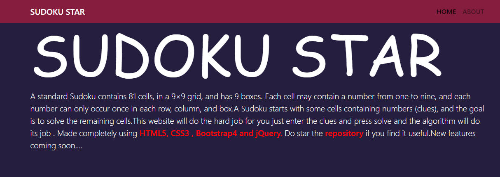
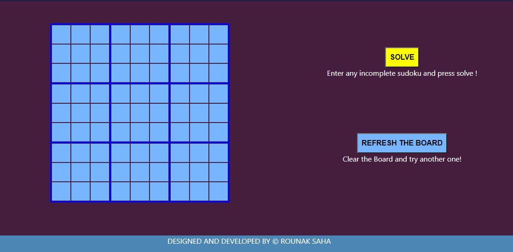
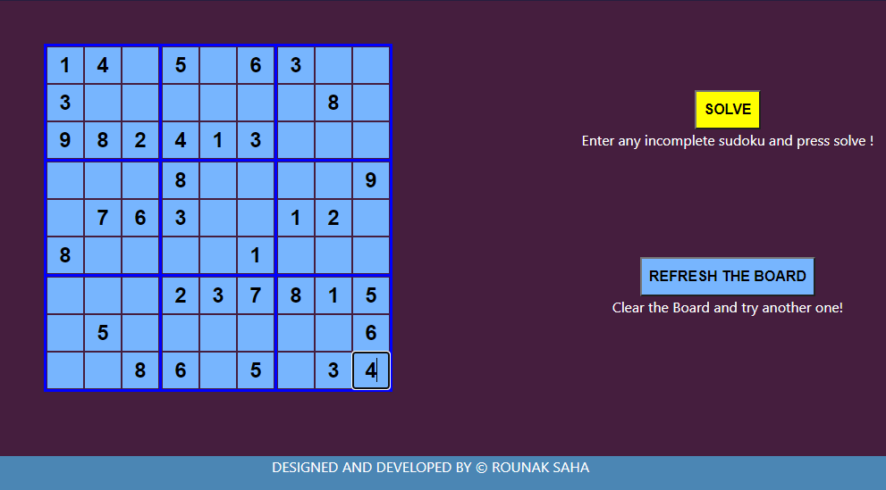
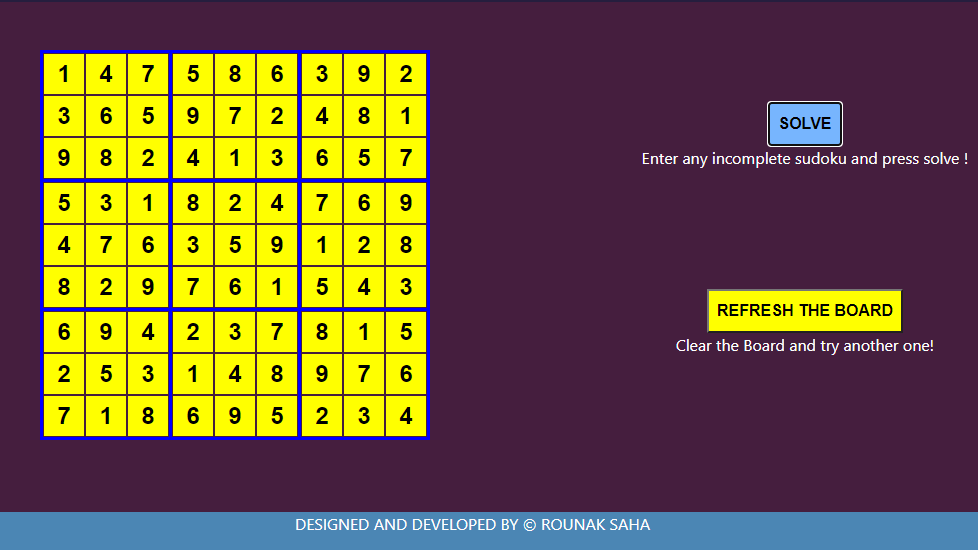

#SUDOKU SOLVER MADE USING HTML,CSS & JAVASCRIPT

## Put any incomplete Sudoku Puzzle and the Website will Solve it for you in matter of Seconds.

The website is published go and check out here :
[SUDOKU_SOLVER](https://rsudoku.netlify.app/)

##GIVEN BELOW ARE THE SNAPSHOTS FROM THE WEBSITE:

The Header Section.

***

The Unfilled Board.

***

The Half Filled Board.

***

The Filled Board or the Solution Board.

***

>Hopefully You liked it.

### Support The Project.
